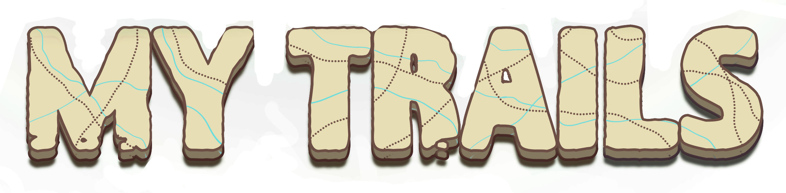

Welcome to MyTrails!

MyTrails is a fun way to keep track of your and your friends' epic hikes! Explore our database of trails, and if you've hiked one, add it to your hikes. You can favorite a hike, rate its difficulty, give an overall rating, and leave a comment about your experience. You can also explore your friends' hikes by visiting our social page. Which one of your friends has hiked the most trails? Which one has hiked the most dangerous trails. Explore MyTrails to find out!

Prerequisites:
- Python
- Node.js
- pipenv

To get started with MyTrails:  
1 - Fork & Clone the repo  
2 - Navigate to the MyTrails directory and run `pipenv install && pipenv shell`  
3 - Run `npm install --prefix client`  
4 - Start the Flask API on localhost:5555 by running: `python server/app.py`  
5 - Launch the React app on localhost:4000 by running: `npm start --prefix client`  
6 - Run `flask db upgrade` to apply the database migrations and set up the schema  
7 - Run `python seed.py` to seed the database with initial data  

Authors: Francesco Wai, Alexis Boucouvalas, Shanley Elizabeth